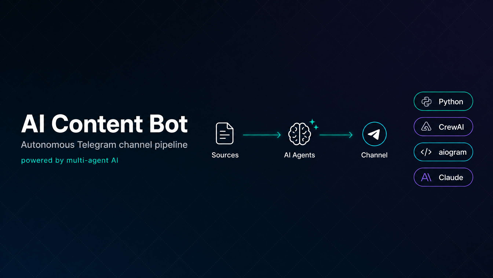
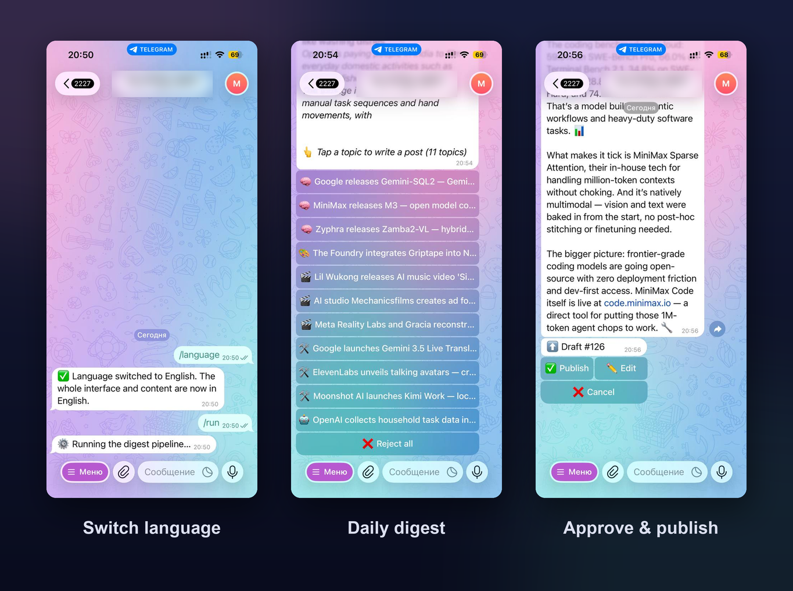

# 🤖 AI Content Bot

<div align="center">
  
</div>

<br>

[](LICENSE)
[](https://python.org)
[](https://docs.aiogram.dev)
[](https://crewai.com)

> Your AI co-editor for running a Telegram channel. It monitors sources, picks the best stories, and writes ready-to-publish posts — then waits for your approval before anything goes live.

Set up your sources once. The bot tracks Telegram channels, RSS feeds, Reddit, HuggingFace, GitHub, and more — selects what matters for your niche, drafts posts in your voice, and delivers them straight to your DMs. You read, approve or edit, hit publish. That's it.

---

## ✨ Features

- 🔍 **Multi-source aggregation** — Telegram channels (Telethon), RSS feeds, Reddit, HuggingFace daily papers, GitHub trending repos, Product Hunt, web digests
- 🧠 **Multi-agent pipeline** — Analyst selects topics → Researcher extracts facts → Writer drafts → Editor polishes
- 📸 **Full media support** — downloads photos, videos, and media albums; fetches `og:image` from article URLs
- ✅ **Human-in-the-loop** — every post lands in your DM for approval before publishing
- ✍️ **Manual post mode** — send any URL or text to the bot and get a ready draft in seconds
- 📰 **Digest mode** — twice-daily selection of top stories grouped by category, you pick which ones to publish
- 🔄 **Any niche** — configure your own source list; the bot adapts to any topic (AI, finance, beauty, sports, anything)
- 🚫 **Built-in filters** — deduplication, ad removal, freshness cutoff, skeptical-ending ban
- 🌐 **Bilingual — Russian & English** — switch the whole interface *and* generated content on the fly with `/language` (🇷🇺 / 🇬🇧), like a language picker in a game; the choice is remembered across restarts

---

## 📱 Screenshots

<div align="center">
  
</div>

---

## 📸 How it works

```
Sources (Telegram / RSS / Reddit / HuggingFace / GitHub)
        ↓
    filter_ads → dedup → freshness filter
        ↓
  DigestCrew — Analyst selects top stories by category
        ↓
  Admin picks a topic → WriterCrew kicks in:
    Researcher (facts) → Writer (draft) → Editor (polish)
        ↓
  Draft + media sent to admin DM
        ↓
  Admin approves → post published to channel
```

---

## 🚀 Quick Start

### Prerequisites

- Python 3.10+
- A Telegram Bot token (from [@BotFather](https://t.me/BotFather))
- A Telegram API app (from [my.telegram.org](https://my.telegram.org)) — for the userbot that reads source channels
- An LLM API key — DeepSeek, OpenAI, Qwen, Claude, or any OpenAI-compatible provider

### Installation

```bash
git clone https://github.com/Kreminskaya/ai-content-bot.git
cd ai-content-bot

python -m venv venv
source venv/bin/activate  # Windows: venv\Scripts\activate

pip install -r requirements.txt
```

### Configuration

```bash
# 1. Copy and fill in your credentials
cp .env.example .env
nano .env

# 2. Add your source channels
cp sources_telegram_channels.example.txt sources_telegram_channels.txt
nano sources_telegram_channels.txt

# 3. Authenticate the Telegram userbot (one-time)
python auth_userbot.py
```

### Run

```bash
# Start the bot
python main.py
```

For production, use the included systemd service:

```bash
cp deploy/ai-telegram-bot.service /etc/systemd/system/
systemctl enable ai-telegram-bot
systemctl start ai-telegram-bot
```

---

## ⚙️ Configuration Reference

All settings live in `.env`. Key variables:

| Variable | Description |
|----------|-------------|
| `TELEGRAM_BOT_TOKEN` | Bot token from @BotFather |
| `ADMIN_CHAT_ID` | Your Telegram user ID (get it from @userinfobot) |
| `TARGET_CHANNEL_ID` | Channel to publish to (`@username` or `-100...` ID) |
| `TELEGRAM_API_ID` / `TELEGRAM_API_HASH` | Userbot credentials from my.telegram.org |
| `LLM_PROVIDER` | `anthropic` or `openai` |
| `ANTHROPIC_API_KEY` / `OPENAI_API_KEY` | Your LLM API key |
| `LLM_MODEL_NAME` | e.g. `claude-sonnet-4-6` or `gpt-4.1-mini` |
| `LANGUAGE` | Initial interface & content language: `ru` or `en`. Users can switch any time with `/language` — the choice is saved to `runtime_state.json`. |

Advanced settings (optional) are in `config.py`:
- `RSS_SOURCES` — list of RSS feed URLs to monitor
- `REDDIT_SUBREDDITS` — subreddits to fetch
- `GITHUB_TRENDING_TOPICS` — GitHub topic tags to watch
- `FETCH_CUTOFF_HOURS` — how far back to look for posts (default: 24h)

---

## 📁 Project Structure

```
ai-content-bot/
├── main.py                  # Entry point — starts bot + scheduler
├── scheduler.py             # APScheduler: digest runs twice daily
├── config.py                # All configurable settings
├── requirements.txt
│
├── agents/
│   ├── crew.py              # WriterCrew: Researcher → Writer → Editor → VisualPrompt
│   └── digest_crew.py       # DigestCrew: Analyst selects and categorises stories
│
├── parsers/
│   ├── telegram_userbot.py  # Telethon-based Telegram channel parser + media downloader
│   ├── source_fetcher.py    # RSS, Reddit, HuggingFace, GitHub, ProductHunt, WebDigest fetchers
│   └── ad_filter.py         # Heuristic ad/spam filter
│
├── bot/
│   ├── handlers.py          # aiogram 3 handlers: approval flow, manual post, edit
│   └── i18n.py              # Bilingual UI engine (RU/EN): all strings, /language switcher
│
├── database/
│   └── models.py            # SQLite schema + CRUD
│
├── deploy/
│   └── setup.sh             # Ubuntu server setup script
│
└── sources_telegram_channels.example.txt  # Template for your channel list
```

---

## 🛠 Tech Stack

| Layer | Technology |
|-------|-----------|
| Bot framework | [aiogram 3](https://docs.aiogram.dev) |
| Telegram parsing | [Telethon](https://docs.telethon.dev) |
| Multi-agent AI | [crewAI](https://crewai.com) |
| LLM | Any provider via [LiteLLM](https://litellm.ai) — DeepSeek, GPT-4, Qwen, Claude, etc. |
| Scheduling | [APScheduler](https://apscheduler.readthedocs.io) |
| HTTP | [httpx](https://www.python-httpx.org) |
| HTML parsing | [BeautifulSoup4](https://www.crummy.com/software/BeautifulSoup/) |
| Database | SQLite |

---

## 🗺️ Roadmap

- [x] Telegram channel monitoring (Telethon + HTTP fallback)
- [x] RSS, Reddit, HuggingFace, GitHub, Product Hunt sources
- [x] Multi-agent writer pipeline (CrewAI)
- [x] Admin approval flow with inline buttons
- [x] Media album support (multiple photos/videos per post)
- [x] Manual post from URL — auto-fetches article content + og:image
- [x] Digest mode with category selection
- [ ] Web UI for post management
- [ ] Webhook deployment option
- [ ] Plugin system for custom source adapters
- [ ] Analytics dashboard (post performance)

---

## 📄 License

MIT — see [LICENSE](LICENSE).

---

⭐ If this saves you time, a star means a lot!
